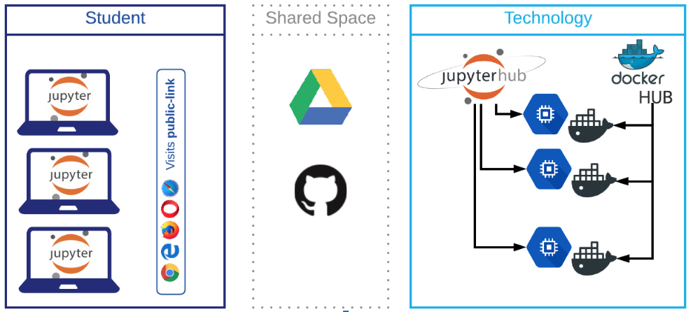

# Introduction

Welcome to the Brown University JupyterHub Documentation & Quickstart Guide. This document is designed to help you get started using Jupyter notebooks served by Google Cloud for use by the Brown University community. The implementation is supported by Brown CIS, and for any questions/comments/concerns regarding this service, please contact the Brown CIS JupyterHub team by emailing jupyter-help@brown.edu. 


**DISCLAIMER: This service is offered** **to Brown University students, staff, and faculty** **for academic education and research purposes** **only. Users are strictly prohibited from utilizing this service for non-academic purposes as stated in the** [TERMS AND SERVICE AGREEMENT](computing-policy.md#brown-jupyterhub-terms-and-service-agreement)**.**


The Brown JupyterHub is designed to provide an environment to run Python, Julia or R without the need to install any software or packages. JupyterHub is interacted with completely through a web browser, where the code submitted is run on the cloud in the backend.

The figure below depitcs the concept and technology behid JupyterHub

If you wish to learn more about JupyterHub, you can visit the porject's documentation

## What Do You Get?

On the Brown JupyterHub, each user is provided their own persistent working directory and compute resource allocation unique from each other user. This means the environment you are provided is only accessible by yourself and CIS support staff. 

Once connected to your server, you are provided an isolated workspace where you can write, run, and backup code straight from your synced Google Drive associated with your @Brown.edu GMail account. There are no time limit restrictions or specified lockout times, so please feel free to use your personal JupyterHub notebook server anytime you want.

## How Do You Get Started?

In order to get started using your own JupyterHub notebook server, please follow the instructions provided in the [Getting Started - Sign In](getting-started/signin.md) section of this document.

