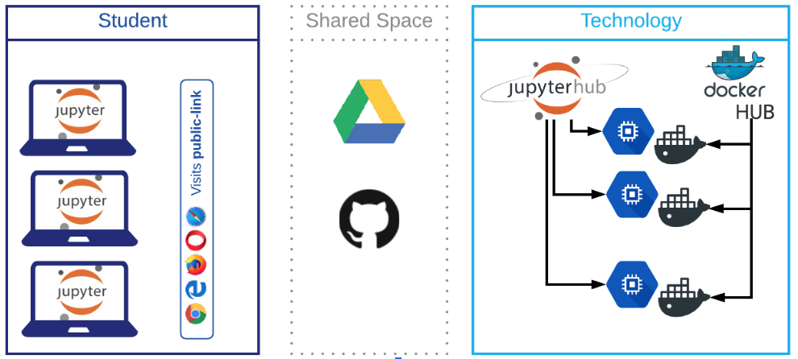

# About JupyterHub

[JupyterHub](https://jupyterhub.readthedocs.io/en/stable/) provides a way to serve Jupyter Notebooks for multiple users. At Brown, we typically deploy JupyterHub in Google Cloud. The figure below depitcs the concept and technology behid JupyterHub.

If you wish to learn more about JupyterHub, you can visit the project's [documentation](https://jupyterhub.readthedocs.io/en/stable/)

## 

