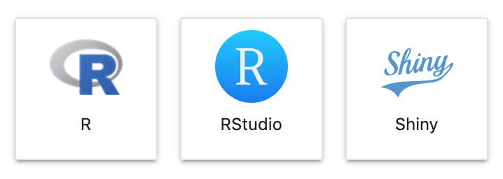

# RStudio and Shiny

In addition to using the R kernel in Jupyter Lab or Notebook, you can also take advantage of RStudio.  Just use the launcher to open a new session for RStudio. You can also create RShiny apps and use the Shiny launcher to serve your app. RStudio and Shiny are not available in Fall2020 images. 

