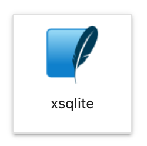

# SQLite

The SQLite Kernel lets users write plain SQL directly on a notebook. For more information on how to use it, check [Xeus-SQLite documentation](https://xeus-sqlite.readthedocs.io/en/latest/api.html).

