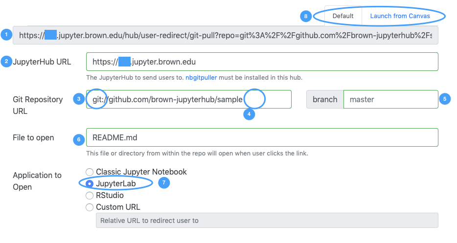

# Link generation

[nbgitpuller](https://jupyterhub.github.io/nbgitpuller/index.html) is a tool lets you distribute content in a git repository to your students by having them click a simple link. It relies on [automatic, opinioned conflict resolution](https://jupyterhub.github.io/nbgitpuller/topic/automatic-merging.html#topic-automatic-merging) that ensures that your students are never exposed to `git` directly. This tools comes pre-installed in your JupyterHub.

If you are not familiar with git and GitHub, we recommend you visit the [Git](../git-basics/git-cheatsheet.md) section of this documentation. Before you can start using `nbgitpuller` you will need a GitHub account and a repository that you wish to distribute to your students. 

Once you have a repository with the material that you wish to distribute, you can generate an _nbgitpuller links_ with the [generator](https://jupyterhub.github.io/nbgitpuller/link).  The requirements of the generator are depicted and explained below. The circled locations required special attention

1. This is the link generated. It can be copied and sent to your students
2. The url of your hub
3. The git repository where you have published your content. Please notice that the url starts can start either with **git://** or **https://.** If you are not expencting your students to have configured github authentication nor have a GitHub account, make sure you use **git://.** 
4. Notice that your URL **does not** end in .git. \(This is often the case if you are pasting URL from GitHub\)
5. The branch of the repository you wish to distribute
6. Optionally, a particular file or directory you want to automatically open for your students once the repository has been synchronized.
7. Choose the **JupyterLab** interaface as this is the default for all of Brown's Hubs
8. Select the Default version of the link, even if  distributing the link via Canvas

The first time a particular student clicks the link, a local copy of the repository is made for the student. On successive clicks, the latest version of the remote repository is fetched, and merged automatically with the student’s local copy using a [series of rules](https://jupyterhub.github.io/nbgitpuller/topic/automatic-merging.html#topic-automatic-merging) that ensure students never get merge conflicts.

### When to use nbgitpuller

1. You are running a JupyterHub for a class & want an easy way to distribute materials to your students without them having to understand what git is.
2. You have a different out of band method for collecting completed assignments / notebooks from students, since they can not just ‘push it back’ via git.

### When to NOT use nbgitpuller

1. You are an instructor using a JupyterHub / running notebooks locally to create materials and push them to a git repository. You should just use git directly, since the assumptions and design of nbgitpuller **will** surprise you in unexpected ways if you are pushing with git but pulling with nbgitpuller.
2. Your students are performing manual git operations on the git repository cloned as well as using nbgitpuller. Mixing manual git operations + automatic nbgitpuller operations is going to cause surprises on an ongoing basis, and should be avoided.

