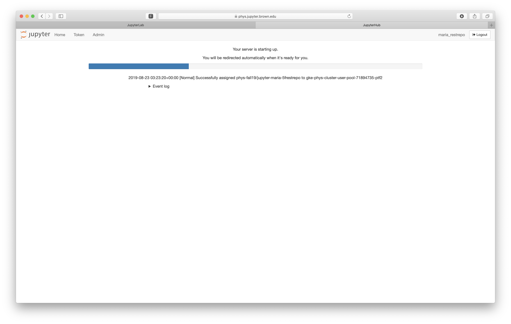

# Sign In

## Before Getting Started

Prior to accessing Brown’s JupyterHub, you will need the following:

* A supported web browser \(Chrome, Firefox, Safari, Microsoft Edge\)
* Be enrolled in a course at Brown that utilizes JupyterHub \(ask your professor\)
* Have read through the [Computing Policies Terms of Service Agreement](https://docs.ccv.brown.edu/jupyterhub/computing-policy)

## Sign In

Start using JupyterHub by signing in to your account for your class.

1. Go to [https://phys.jupyter.brown.edu](https://phys.jupyter.brown.edu) and click "Sign in with Brown Gmail Login"  
2. Enter your **Brown email** address \(example: john\_doe@brown.edu\) and password

Once authenticated, you should automatically be logged in and a JupyterHub server will begin launching. A status bar will appear with detailed information regarding your server startup.

Once connected, you should arrive at the JupyterHub home page as seen below. For more information about the menu buttons and their functionality, see the [Interface Overview](../using-your-hub-1/interface-overview.md) documentation.


Future logins will automatically spawn any active notebooks automatically.


