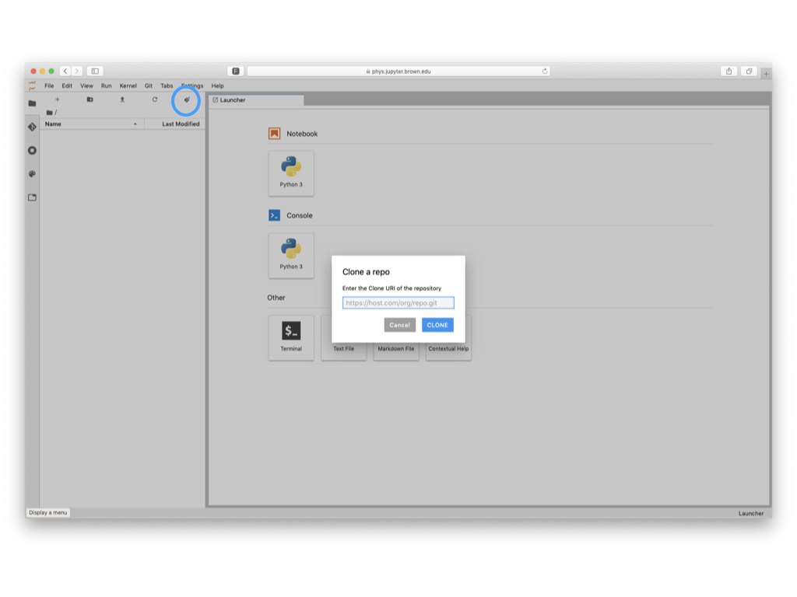

# Downloading Content

Downloading a GitHub repository into your JupyterHub is done via `git clone`. The operation can be done via the Git Plugin interface that comes pre-installed in your JupyterHub or a terminal session

## 1. Using the Git Plugin Interface

1. Select the Git Clone button circled in blue below
2. Paste the url at the prompt
3. A new folder with your repository will show in your file browser


It may take few seconds for your repository folder to show up in the file browser


To launch a specific notebook file downloaded, see the [Launch a Notebook](../getting-started/launch-an-existing-notebook.md#opening-an-existing-notebook-on-your-hub) steps



## 2. Clone using a terminal session 

Launch a terminal on JupyterHub by following the instructions below:

1. [Launch a terminal session](../getting-started/launch-a-terminal-session.md)
2. Clone your assignment to the hub using the git clone command

```
git clone <gitURL>
```


 Replace &lt;gitURL&gt; with your copied git URL via your clipboard from [Step 2](../github-classroom-student-guide/getting-assignments.md#step-2-copy-assignment-url)


To launch a specific notebook file downloaded, see the [Launch a Notebook](../getting-started/launch-an-existing-notebook.md#opening-an-existing-notebook-on-your-hub) steps

