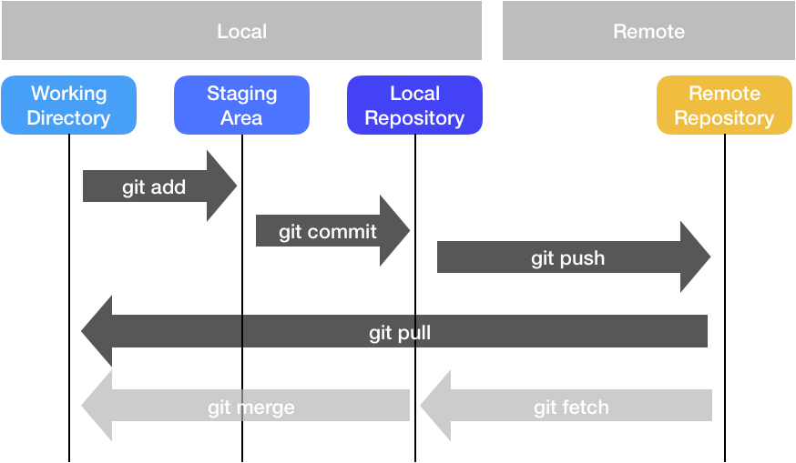

# Overview

Git is a version control system that enables you to track changes to files. With Git, you are able to revert files back to previous versions, restore deleted files, remove added files and even track down where a particular line of code was introduced.

Git creates a hidden `.git` folder \(in the current folder\) to store the details of the file system - this folder contains all the data required to track your files and is known as a **repository**, or repo.

Git tracks file changes by the user creating a _save point_, or in Git terms a **commit**. Each commit takes a snapshot of the current file system. Commits are uniquely identified by a SHA–1 hash. This is a 40 character string which may along the lines of `ded7a0db6422d59e9893e975e32275fc36f853da`This hash can be used to track a particular commit within the repository. 

Nearly all operations that are performed by Git are in you local computing environment, for the exception of few used purly to synchronize with a remote. Some of the most common git operations are depicted below. In summary a typical flow consists of making changes to your files, _staging_ them via `git add`, marking a save point via `git commit`, then finally syncing to your remote \(e.g., GitHub\) via `git push`. If you are pushing changes to your remote from multiple places, you can bring changes your most recent version usin `git pull`, which is the equivalent of doing `git fetch` followed by a `git merge` operation

