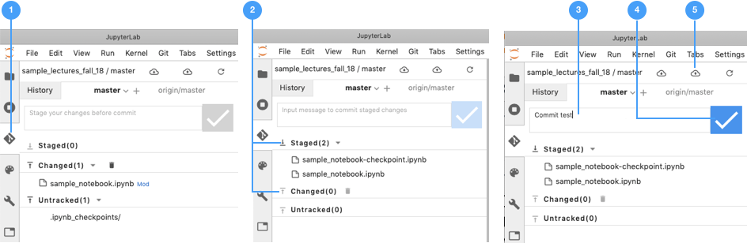

# Saving and Uploading \(git commit/push\)

Once you have made changes to an assignment and are ready to save your progress, there are a few steps that you must do prior to closing the hub if using git to keep your changes save. Once again, the interaction with git can be via Plugin user interface or a terminal session

## 1. Saving your work using GIT Plugin \(UI\)

 Saving your changes and uploading them to GitHub is outlined and illustrated below:

1. Select the  Git Plugin tab from the left sidebar
2. Files that have chaged will show under the **Changed** category. New files will appear under the **Untracked** category. Use to move your changes to the _**staging area**_ \([review git basic commands](overview.md)\) and use the  to _**unstage.**_
3. Once all files have been _**staged**_, you can _**commit**_  your changes by typing a _**commit message**_
4. Confirm your commit  
5. Finally, you need to _**push**_  your commited changes to GitHub. You  do so using the   icon




Committing changes does not automatically save them to the repository! Don't forget to do step 5 and push the changes.


## 2. Saving your work using GIT command line

### 2.1: Open terminal and move to working assignment directory

1. Launch a terminal on JupyterHub 
2. Navigate to your current working assignment directory using the `cd` command

```
cd assignmentDirectory
```

### 2.2: Commit Changes to be Saved \(git add/commit\)

From the directory containing your actively worked on assignment, you must first add and commit changes you have made which will be prepared to be saved remotely on the git repository. Think of this as staging any changes you have made, but not actually saving them yet. This first step provides the opportunity to add a commit message where you can document the changes you have made with this current save, which should be descriptive but not necessarily comprehensive.

```
git commit -a -m "Notes about changes"
```


Committing changes does not automatically save them to the repository! Don't forget to do step 3 and push the changes.



The _**-m**_ flag means you are passing a commit message, which must be inside double quotes. If you forget to pass the message, it will launch the terminal editor **emacs.** You can type your message, save with `Ctrl/Cmd+x` then `Ctrl/Cmd + s` and quit using `Ctrl/Cmd +` `x` then `Ctrl/Cmd + c`


### 2.3 Save Changes to Repository \(git push\)

Once the changes have been stage following [Step 2](../github-classroom-student-guide/submitting-assignments.md#step-2-commit-changes-to-be-saved-git-add-commit), the last step is to actually save the changes to the remote repository using the push command.

```
$ git push
```

It will require you to enter your github credentials and then will begin to save the changes to your remote repository for the git classroom. 


 It is recommended that you git commit and push at the end of each working session or whenever a major change has been made to the codebase.


