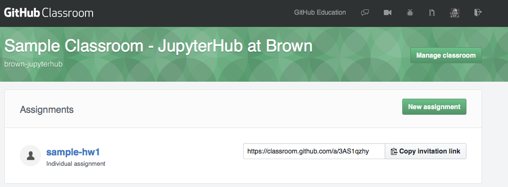
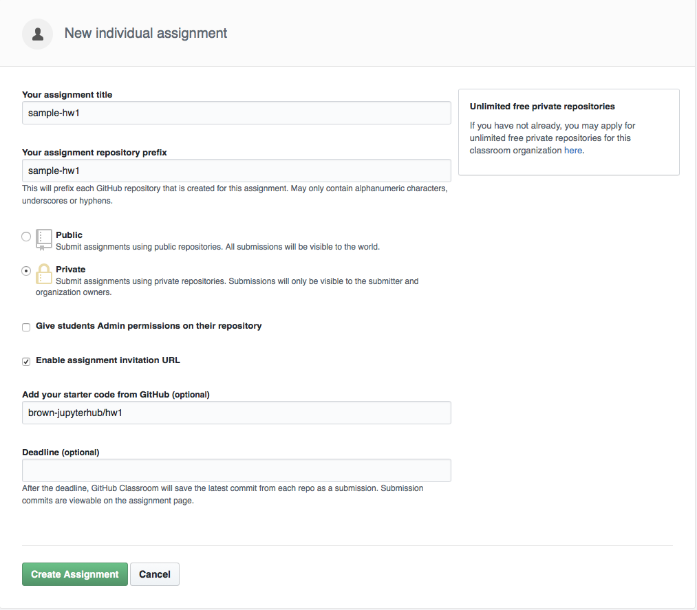
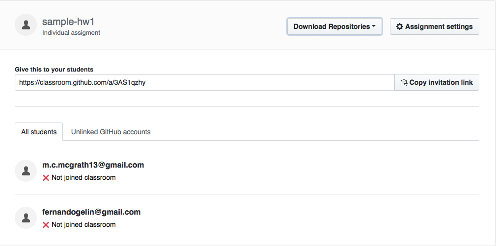

# Distributing Homework 

[**GitHub Classroom** ](https://www.notion.so/c5c302e2-70ca-457c-b40c-9c6366c7c6b6) / [Set Up your Classroom ](https://www.notion.so/829e2e79-33c6-4a2d-833a-c4349d662367) / [Distributing Homework ](https://www.notion.so/67b8529f-f378-4afb-a737-726f7fcd0b13)

---

To create assignments, visit your classroom home and select upper right button to create a new assignment

## Considerations

- Choose appropriate level of privacy: Private or public
- Give students admin on their repo. That means they could invite other people to it, make it public etc
- Select starter code from a pre-existing repository

## Distribute homework link

## Sample Assignment Link

[https://classroom.github.com/a/3AS1qzhy](https://classroom.github.com/a/3AS1qzhy)