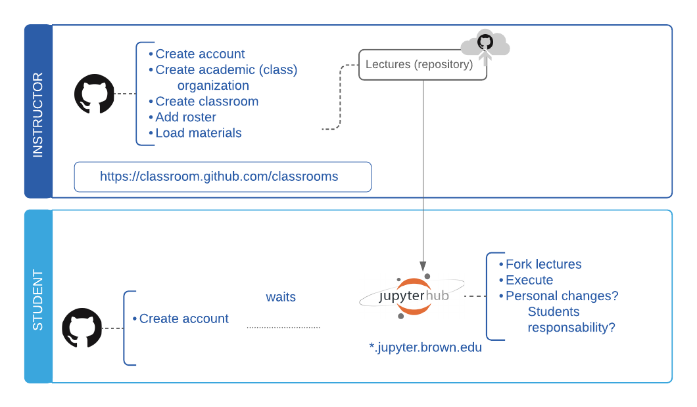

# Distributing Lectures

## Option 1: Distribute using nbgitpuller

The first time a particular student clicks the link, a local copy of the repository is made for the student. On successive clicks, the latest version of the remote repository is fetched, and merged automatically with the student’s local copy using a [series of rules](https://jupyterhub.github.io/nbgitpuller/topic/automatic-merging.html#topic-automatic-merging) that ensure students never get merge conflicts.

## Option 1: Distribute one lecture materials as assigments

1. Have the materials for one lecture in a repository  
2. Distribute as assignment, with its own link, and no deadline

### Advantages

*  Students can stay as outside collaborators for ever.
* There is no special consideration for shopping period
*  All of their lecture work is automatically set up in your organization … with a default place for them to work there are less chances for them to be pushing it to their own public GitHub…
* Less management of merging conflicts and remotes

### Disadvantages

* There will be a lot of repositories in the organization.
* No simple mechanism for pushing changes after distributiom

## Option2: All lectures in one repository

**During shopping period:**

1. Set up the lectures to be public
2. Students clone and pull from public repository
3. 
**After shopping period:**

1. Have a first assigment to generate a link.  
2.  Students that accept the link become **outside collaborators** in your organization  
3. Invite the students to join the organization.   
4. You should make a team for the students and give them read access to the private lecture repository  
5. As members of the organization, they can create a repository to push their personal changes to the lectures. In order to sync with their own repository and with yours, they will need to set up two remotes. See [https://help.github.com/articles/adding-a-remote/](https://help.github.com/articles/adding-a-remote/) for more help  
  

### 

