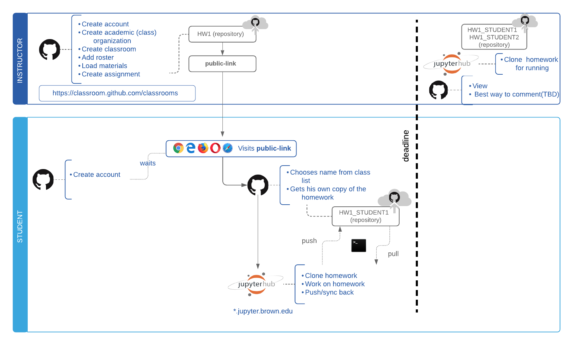

# Distributing Homework

## Workflow Overview

## Distributing Homework

To create assignments, visit your classroom home and select upper right button to create a new assignment

### Considerations

* Choose appropriate level of privacy: Private or public
* Give students admin on their repo. That means they could invite other people to it, make it public etc
* Select starter code from a pre-existing repository

### Distribute homework link

## Grading and Feedback

After the submission deadline, there are several workflows you can follow. Here we outline few suggestions and we invite you to contribute, your own workflows.

Clone all homework repositories \(with and automated script - coming soon\), then:

Possible ways of generating feedback include:

### General Comments:

* README
* CANVAS

### Inline comments:

* Write markdown cells inside the hub - commit and push
  * Student views inside jupyterhub
  * Could use [https://www.reviewnb.com/](https://www.reviewnb.com/#features) for nicer diff
* Write to a script .pyb that is kept insync
  * Student views inside github
* PDF feedback via CANVAS

