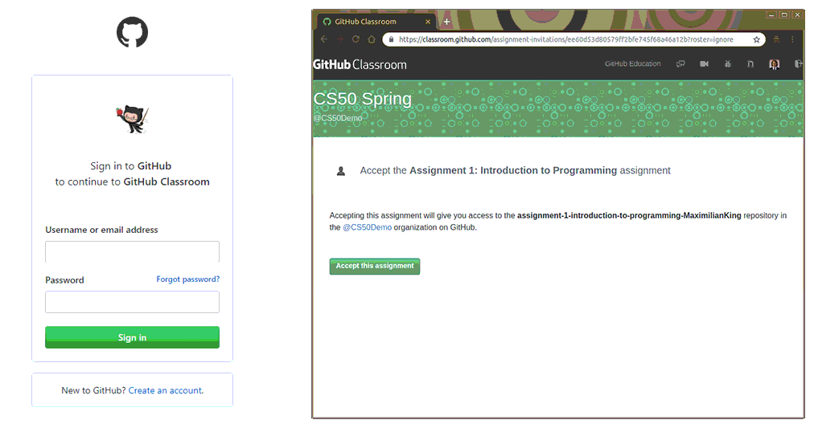

# Getting Assignments

## Step 1: Accept Assignment

In order to begin working on your assigned coding project, you must first accept the GitHub assignment by clicking on the corresponding assignment link provided by your instructor. It will require you to log into your GitHub account \(if you do not have one, see [Getting Started - Create a GitHub account](overview.md#step-0-create-a-github-account)\). Once logged in, click the Accept this assignment and your repository will be automatically generated.




## Step 2: Copy Assignment URL

Once your assignment repository has been created, you must get the exact URL to the assignment you wish to download to the hub. To do this, either a\) click the corresponding link for where your assignment has been created \(see image above\), or b\) navigate to your github repository list, then:

1. Navigate to the assignment you wish to work on in GitHub
2. Click the"Clone or download" button 
3. Copy the Git URL to your clipboard by clicking the clipboard button  


## Step 3: Download to Hub \(git clone\)

Now that you have created a version of your assignment on GitHub, and have copied the git URL to your clipboard, you may download it to your personal JupyterHub space by using the git clone commands in a terminal session.. 

Launch a terminal on JupyterHub by following the instructions below:

1. Select the localFile Browser from left sidebar
2. Create a new launcher using the New Launcher button
3. Click **Terminal** under the **Other** section
4. A new “Terminal \#” window will appear your browser.
5. Clone your assignment to the hub using the git clone command

```
$git clone <gitURL>
```


 Replace &lt;gitURL&gt; with your copied git URL via your clipboard from [Step 2](getting-assignments.md#step-2-copy-assignment-url)


It will ask for your GitHub username and password, which once entered, a copy of the assignment will be downloaded to your hub. To launch a specific notebook file downloaded, see the [Launch a Notebook](../getting-started/launch-an-existing-notebook.md#opening-an-existing-notebook-on-your-hub) steps

