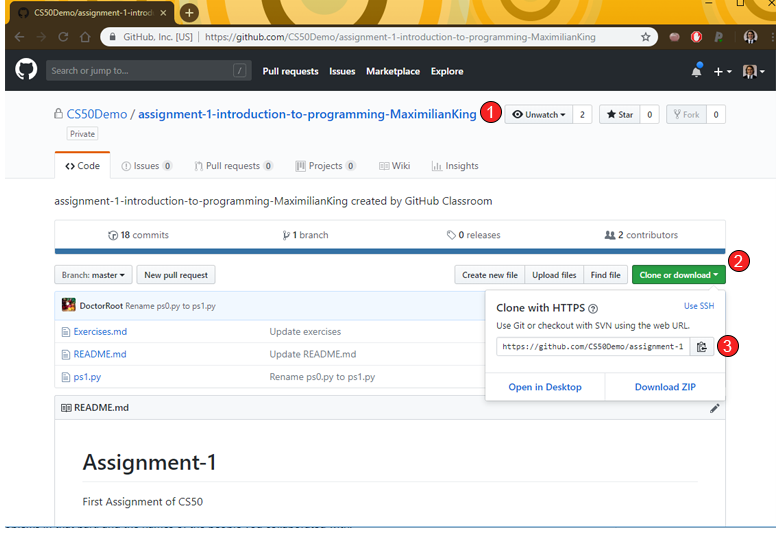

# Getting and Uploading Assignments

## Step 1: Accept Assignment

In order to begin working on your assigned coding project, you must first accept the GitHub assignment by clicking on the corresponding assignment link provided by your instructor. It will require you to log into your GitHub account \(if you do not have one, see [Getting Started - Create a GitHub account](overview.md#step-0-create-a-github-account)\). Once logged in, click the Accept this assignment and your repository will be automatically generated.

## Step 2: Copy Assignment URL

Once your assignment repository has been created, you must get the exact URL to the assignment you wish to download to the hub. To do this, either a\) click the corresponding link for where your assignment has been created \(see image above\), or b\) navigate to your github repository list, then:

1. Navigate to the assignment you wish to work on in GitHub
2. Click the"Clone or download" button 
3. Copy the Git URL to your clipboard by clicking the clipboard button  

## Step 3: Download to content to JupyterHub

Follow the steps in the [Downloading Content](../git-basics/git-clone.md) page in the previous section

## Step 4: Save and upload changes to your assigment materials

As you work on your assigment, it is a good practice to **commit and push** your changes regularly. Follow the steps in the [Saving and Uploading](../git-basics/saving-and-uploading-git-commit-push.md) page in the previous section

