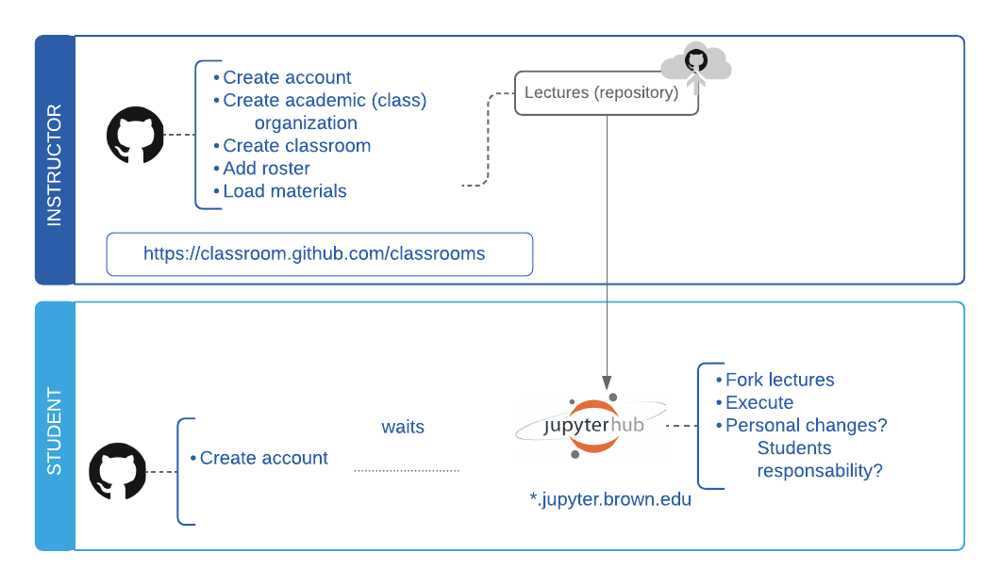

# **GitHub Classroom** 

[GitHub Classroom](https://classroom.github.com) makes it easy to distribute materials and assigments to students while maintaining the oweneship of all materials in your own organization. The following diagrams will help you undestrand these workflows. To get started follow to the [Getting Started](./Getting-Started-8438bf05-0895-472c-9204-d76af01b3fc7.md) section

---

## Workflow Overview:

**Want to suggest changes to the diagrams?**

* [Lucidchart (assingment) file for editing](https://www.lucidchart.com/invitations/accept/a3c2c3ed-d664-4c3a-8f26-e68fc2aa6cba)
* [Lucidchart (lectures) file for editing](https://www.lucidchart.com/invitations/accept/76742259-596c-4a33-a76e-ee48dde5d240)

## Why use GitHub Classroom:

- **Introduce students to *version control**,* one of the most important and foundational practices in software engineering.
- **Spend more time with students, less on setup:** Students accept an assignment with one link, so you can get straight to the material.
- **Bootstrap group assignments in a snap:** Invite students to a shared repository, and cap the number of students per group. Use the same groups over and over again, or create new ones.
- **Download all repositories with the click of a button:** When you're ready to grade, download assignments to your machine from GitHub Classroom, or use our new desktop client, Classroom Assistant.
- **More insight into student work than ever before:** See when students accept the assignment, and access their work from the moment they start. With version control, catch when they get stuck and help them rewind.
- **You are in control:** Students can work individually or in groups, in public or in private. Set permissions for teaching assistants or graders.
- **Scales for large courses with ease:** If you have a small course, Classroom will make your life easier and save you time. If you have hundreds of students, we have your covered: as many repositories as you need, and webhooks to integrate automated testing tools.
- **Works with your Learning Management System (LMS):** Students submit a link to their assignment repository to your learning management system. Give feedback through comments in GitHub, but keep grades in your LMS.
- **Are you super-advanced?** Do you want to build your own tools? GitHub Classroom is [open source](https://github.com/education/classroom), and we 💖 contributions.

## Possible Disadvantages:

- Students and you will need to create an account in github
- Students and you will need to learn a little bit if ***Version Countrol (git),***
- You ******may need to spend a class on the basics of ***Git***