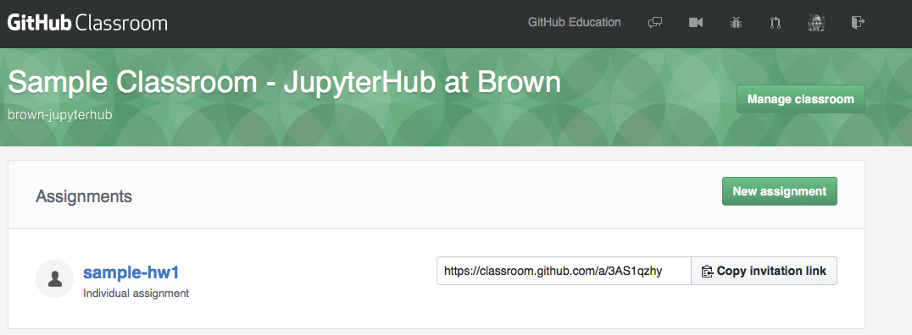
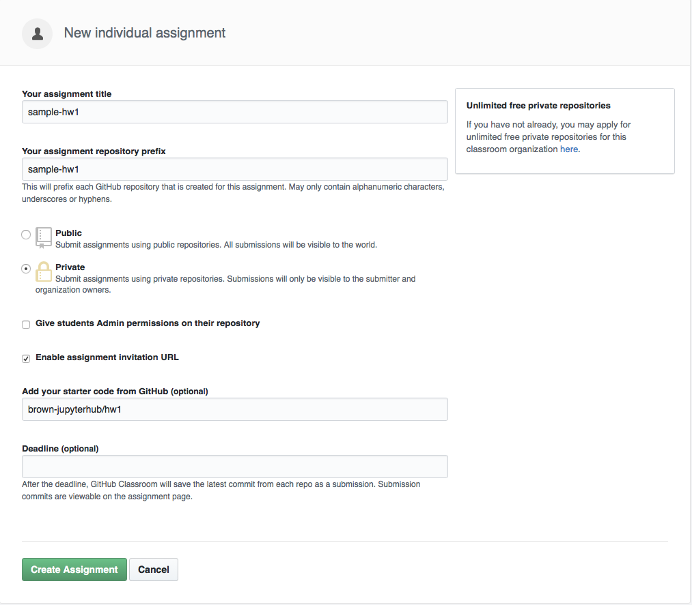
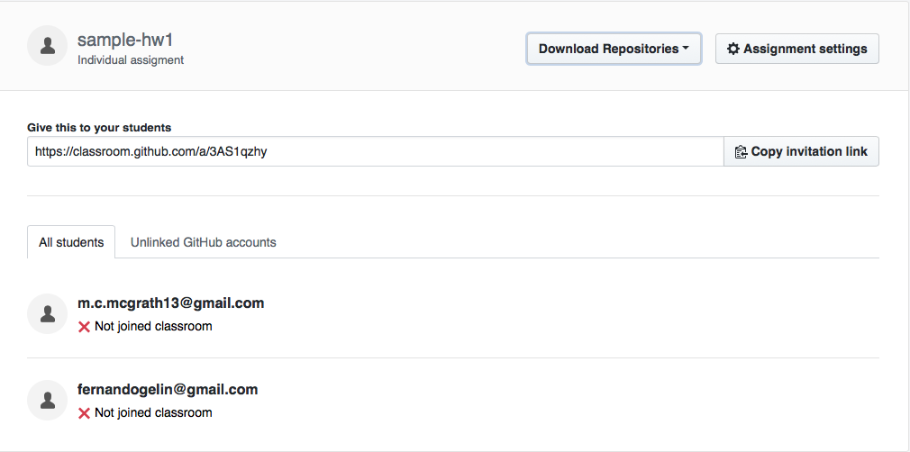

# Set Up your Classroom 

Follow instructions to create your classroom under your course organization [here](https://classroom.github.com/classrooms). A new semester needs a new classroom. You will be asked to set-up a roster. 

**Do not re-use classroom over years**

## Distributing Lectures

### All lectures (per semester) in one repository

This is probably the simplest option. We recommend to name the repository according to the current semester. For instance:

[brown-jupyterhub/sample_lectures_fall_18](https://github.com/brown-jupyterhub/sample_lectures_fall_18)

- The simplest is to keep the repository public, that way all students can *clone it*  freely
- You can keep a private version with all your reference lectures and simply add lectures, one at a time
- If you don't wish to have your lecture material public to the world, the you can distribute the lecture material as an assignment, with no deadline

### Lecture per repository

This likely adds more book-keeping that its necessary, but has the advantage of controlling dependencies and settings on a per lecture basis. You may want to use this setup, for lectures that have very unique code dependencies.

## Distributing Homework

To create assignments, visit your classroom home and select upper right button to create a new assignment

###  Considerations

- Choose appropriate level of privacy: Private or public
- Give students admin on their repo. That means they could invite other people to it, make it public etc
- Select starter code from a pre-existing repository

### Distribute homework link

***Sample Assignment Link**

[https://classroom.github.com/a/3AS1qzhy](https://classroom.github.com/a/3AS1qzhy)

## Grading and Feedback

After the submission deadline, there are several workflows you can follow. Here we outline few suggestions and we invite you to contribute, your own workflows.

Clone all homework repositories (with and automated script - coming soon), then:

Possible ways of generating feedback include:

### General Comments:

- README
- CANVAS

### Inline comments:

- Write markdown cells inside the hub - commit and push
    - Student views inside jupyterhub
    - Could use [https://www.reviewnb.com/](https://www.reviewnb.com/#features) for nicer diff
- Write to a script .pyb that is kept insync
    - Student views inside github
- PDF feedback via CANVAS

#### Sample Classroom

[Sample Classroom](https://classroom.github.com/classrooms/42362824-sample-classroom-jupyterhub-at-brown)