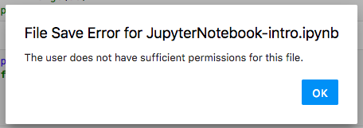

# Caveats

While the files from Google Drive can be shared with the Hub, the files are not mounted nor copied into the file system of the Hub. Instead, files are streammed and this has afects some of the functionality built into the hub

### Notebooks cannot be printed

They also cannot be exported to script/html

### Data files from Drive cannot be read into a notebook

If you need to read data into a notebook that is store in your Google Drive, you will have to upload the data directly into the Hub

### Errors Opening a Notebook Shared With You

If you have a notebook shared with you, be it from your professor or a colleague, chances are the sharer hasn't given you full write access to the aforementioned file. This means that you will be able to launch the notebook and run/edit the code, but will not be able to save or update the original code. Additionally, you will regularly receive errors regarding "File Save Error" or "Insufficient permissions" as seen below.

To mitigate this, we recommend that when a notebook is shared with you via Google Drive, you **add a copy of the files to your personal drive** so that you can freely modify/save the file. Also, as the owner of the file, you will be able to take these documents with you in the event that the original file owner revokes file access. 

To save a file shared with you on Google Drive to your own personal drive, do the following:

1. Navigate to the shared file/folder on your Google Drive [Shared with me](https://drive.google.com/drive/shared-with-me) section
2. Right click the file/folder you wish to copy
3. Select "Make a copy" to clone the file/folder to your personal drive.

A new copy of the file/folder will appear into your [My Drive](https://drive.google.com/drive/my-drive) section of your Google Drive. In order to open this notebook, follow the instructions listed above [Opening an Existing Notebook You Own](../getting-started/launch-an-existing-notebook.md#opening-an-existing-notebook-you-own-from-google-drive)

