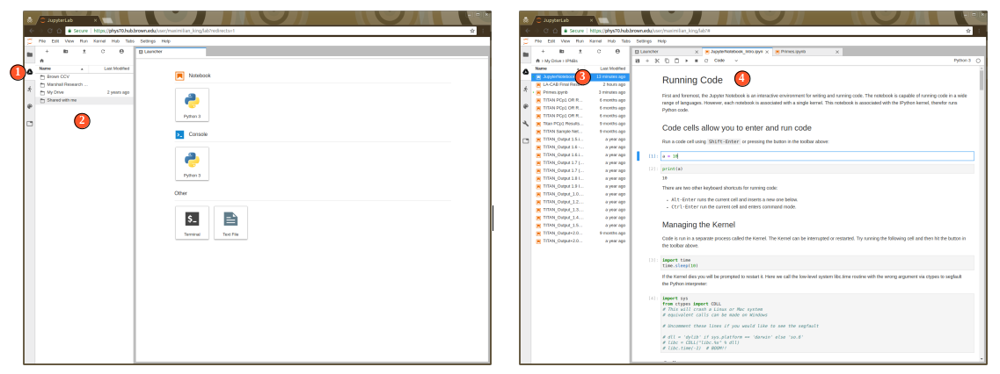

# Launching Drive Notebooks

## Opening an Existing Notebook You Own from Google Drive


Prior to following these steps, please ensure you have followed the [Sync Google Drive](sign-in.md#how-to-enable-google-drive) instructions.


Now that your drive has been synced, navigate to a Jupyter Notebook \(.ipynb\) file you wish to open and double click on it to launch a kernel session with that notebook.

1. Select  Google Drive browser from left sidebar
2. Navigate to the "My Drive" folder, then locate the notebook you wish to open using the file browser
3. Double click or right click on the file and select **Open**
4. A new tab will launch containing your Notebook


If you do not have any existing notebooks, feel free to download and explore the Introduction to Python3 on Jupyter Notebooks by clicking [here](https://drive.google.com/drive/folders/15ztZjxdZ_eZC_RV5tEVmizNfNP8Km7oh)**.**


## 

