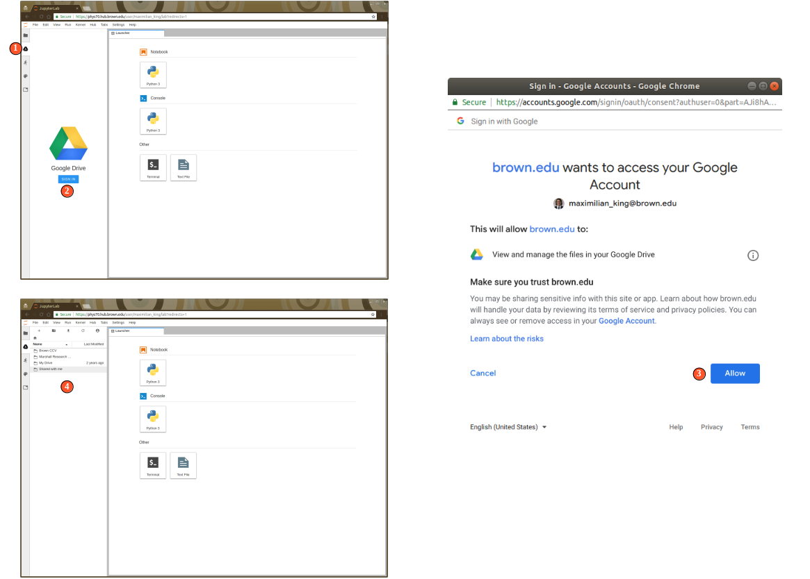

# Sync Google Drive

## How to Enable Google Drive

JupyterHub is designed to run documents saved on your Brown University Google Drive synced account for long-term backups and version control. In order to utilize this feature, you must first allow your hub to access your drive by clicking **Sign In**. From here, you will be asked to approve the hub to access you drive and can do so by clicking **Allow**. Once completed, you should see the file browser now shows all the directories of you Google drive. Congratulations, you are now properly synced and can begin to load, edit, and run Jupyter Notebook files \(.ipynb\) from your drive on JupyterHub!

### To sync your Google Drive account:

1. Select Google Drive browser from left sidebar
2. Sign into Drive. Click **Sign In**
3. Provide access. Click **Allow**
4. Contents of Google Drive will appear in the file browser


Notebooks launched from your Google Drive will automatically sync and save periodically.


