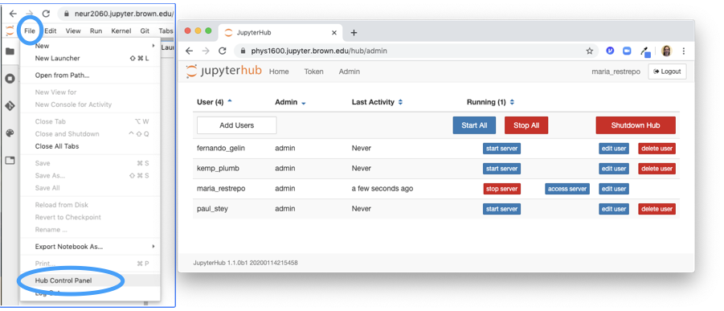

# Instructor's Checklist

* Share this [Brown University JupyterHub Guide](https://docs.ccv.brown.edu/jupyterhub)  with all students. 
* If planning to use hub during class time, have the students launch their hubs at the very beginning of class \(can experience a few minutes of bootup time if large spike active hubs\)
* Familiarize yourself with the  "Admin" Tab. You can access by visitin File -&gt; Hub Control or by visiting https://&lt;yourclassid&gt;.[jupyter.brown.edu/hub/admin](http://jupyter.brown.edu/hub/admin). Through this interface you can stop and restart their server if they are having troble accessing their environment.

* Students can install their own python packages using the user-specific install flag. As an example, to install &lt;package&gt;, use `pip install --user <package>`
* Is a required package missing? Hub crashing? Need more computational resources? Student having an issue you cannot resolve? Don't hesitate to email us at [jupyter-help@brown.edu](mailto:jupyter-help@brown.edu)

#### If you are using Git and GitHub Classroom

* Create and share your GitHub classroom invite link with students
* Remind students to push to their github repo at the end of every session \(or whenever they make major progress on a project\). Instructions are in JupyterHub guide above.

