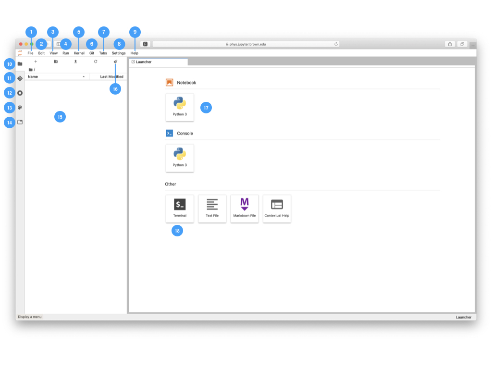

# Interface Overview

## JupyterLab

JupyterLab is the next generation web-interface for Jupyter Notebooks. It enables you to use side by side view, text editors, terminals, data file viewers, markdown preview and other custom components along with notebooks. Highlighted features are:

* Drag-and-drop to reorder notebook cells and copy them between notebooks.
* Run code blocks interactively from text files \(.py, .R, .md, .tex, etc.\).
* Link a code console to a notebook kernel to explore code interactively without cluttering up the notebook with temporary scratch work.
* Edit popular file formats with live preview, such as Markdown, JSON, CSV, Vega, VegaLite, and more.


For more indept guides and videos about JupyterLab, please see the [official documentation](https://jupyterlab.readthedocs.io/en/latest/user/interface.html)  


## Brief JupyterHub Lab Interface

1. **File**: actions related to files and directories
2. **Edit**: actions related to editing documents and other activities
3. **View**: actions that alter the appearance of JupyterLab
4. **Run**: actions for running code in different activities such as notebooks and code consoles
5. **Kernel**: actions for managing kernels, which are separate processes for running code
6. **Hub**: actions related to the hub such as shutdown or logout.
7. **Tabs**: a list of the open documents and activities in the dock panel
8. **Settings**: common settings and an advanced settings editor
9. **Help**: a list of JupyterLab and kernel help links
10. **File Browser**: Local file browser for JupyterHub. Not synced with Google Drive
11. **Git Plugin Actions**: View of files that have changed and an interface to git actions such as stage, commit, push and pull
12. **Running Terminals and Kernels**: List of active running kernels.
13. **Command Palette**: Keyboard-driven way to search for and run JupyterLab commands
14. **Open Tabs**: List of active notebook tabs and related functionality
15. **Browser Window**: Active browser window.
16. **Git Clone:** Add or clone a new repository
17. **Notebook launcher**: Available notebook kernels to launch.
18. **Terminal** **launcher**: Launch a new terminal window

