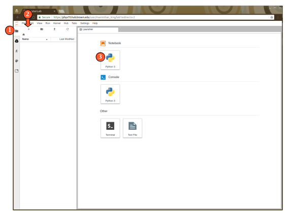

# Creating a New Blank Notebook

## Creating a Notebook on JupyterHub


Notebooks created and stored on locally\(the cloud\) on the JupyterHub will persist between logins, but will not have any long-term redundant backups . Should you lose permissions to access the hub \(i.e., end of semester\), or should the hub crash, these files may be lost.


To create a local notebook, follow the instructions below:

1. Select the localFile Browser from left sidebar
2. Create a new launcher using the New Launcher button
3. Click **Python 3** under the **Notebook** section
4. A new “Unititled\(\#\).ipynb” file will appear in your current working drive directory and a blank Notebook will launch. Click on "Untitled" to change the name of the file

