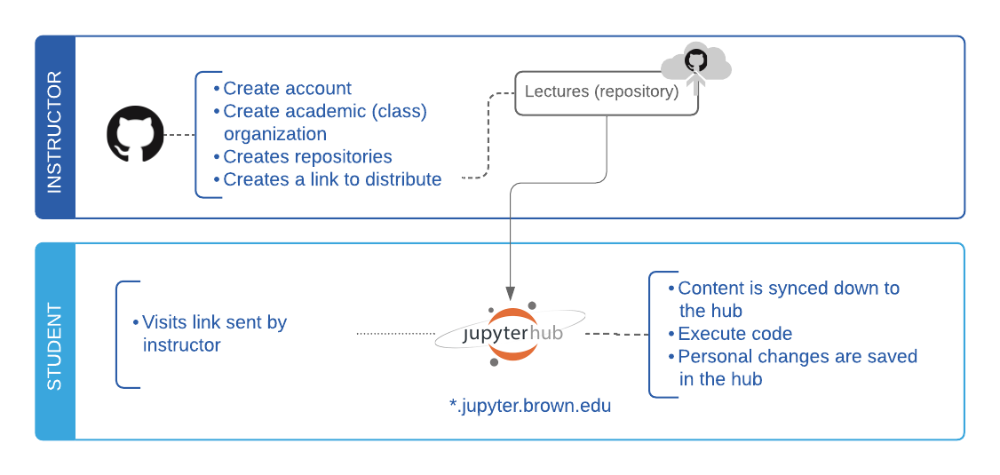

# Choose Your Workflow

Depending on how familiar students are to _Version Control_ technologies such as _**Git**_, different workflows may fit best the strategy used to distribute coding materials and assignments. 

## ① Distribute using a \(puller\) link

#### Who is this worflow for:

* Instructors looking for a simple way to **dristribute materials to students who will NOT be introduced to git.** 

#### Related sections in the documentation \(look for  ① in the section title\):

👩‍💻Students only need to be familiar with following sections

* Getting Started  
* Using Your Hub
* Getting Support 

👨‍🏫 Instructors will need to visit the following sub-sections:

* Content sync via git
  * [Git Overview](git-basics/overview.md)
  * [Create GitHub Account](git-basics/create-github-account.md)
  * [Configuring Git in JupyterHub](git-basics/configure-git-and-github.md)
  * [Downloading Content](git-basics/git-clone.md)
  * [Saving and Uploading Content](git-basics/saving-and-uploading-git-commit-push.md)
* Content sync via link
  * [Link generation](content-sync-via-link/nbgitpuller.md)
    * 

## ② Distribute via GitHub Classroom

#### Who is this worflow for:

* Instructors looking  **dristribute materials to students using git and GitHub.** 

Using Git and GitHub to distribute your materials encourages best practices for software development and additionally adds versioning to changes made to the source code, allowing students to revert to prior versions if necessary. If you will be using Git, we recommend using _**GitHub Classroom**_  to help automate the process.  

#### Related sections in the documentation \(look for  ② in the section title\):

👩‍💻Students  should familiarize themselves with:  

* Content Sync via GIT
* GitHub Classroom \(Student Guide\)

👨‍🏫Instructors should familiarize themselves with:

* Content Sync via Link
* Content Sync via GIT
* GitHub Classroom \(Instructor Guide\)

 

