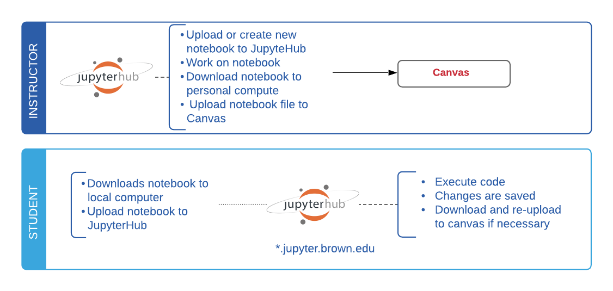

# Determine Your Workflow

Depending on how familiar students are to _Version Control_ technologies such as _**Git**_, different workflows may fit best the strategy used to distribute coding materials and assignments. 

## Ⓢ① Students in classes that are new to programming and/or version control 

#### Related sections in the documentation \(look for  ① and Ⓢ  in the section title\):

* [Getting Started ](getting-started/signin.md) 
* [Using Your Hub](using-your-hub/interface-overview.md)
* [Getting Support ](help-and-support/getting-support.md)

## Ⓣ① Teachers looking for a simple way to **distribute materials to students who will NOT be introduced to git.** 

There are two options:

### Direct Upload:

This simple workflow assumes **no git knowledge** from the student nor the instructor. Notebook files are shared via CANVAS and directly uploaded to JupyterHub

#### Related sections in the documentation \(look for Ⓣ ① in the section title\):

* [Getting Started ](github-classroom-student-guide/overview.md) 
* [Using Your Hub](getting-started/signin.md)

### Via Smart Link

Using this workflow, teachers have the ability to generate a **smart link** that pulls the materials automatically for students into their JupyterHub. If you are a teacher using this method, you will need **basic familiarity with git and github.**

#### Related sections in the documentation :

* [Content sync via link Ⓣ①](content-sync-via-link/nbgitpuller.md)

## ⓉⓈ② Teachers and Students using Git/GitHub and GitHub Classroom

Using Git and GitHub to distribute your materials encourages best practices for software development and additionally adds versioning to changes made to the source code, allowing students to revert to prior versions if necessary. If you will be using Git, we recommend using _**GitHub Classroom**_  to help automate the process.  

#### Related sections in the documentation \(look for  ② in the section title\):

Ⓢ Students  should familiarize themselves with:  

* [Content Sync via GIT](git-basics/overview.md)
* [GitHub Classroom \(Student Guide\)](github-classroom-student-guide/overview.md)

Ⓣ Teachers should familiarize themselves with:

* [Content Sync via GIT](git-basics/overview.md)
* [GitHub Classroom \(Instructor Guide\)](github-classroom-instructor-guide/overview.md)

 

